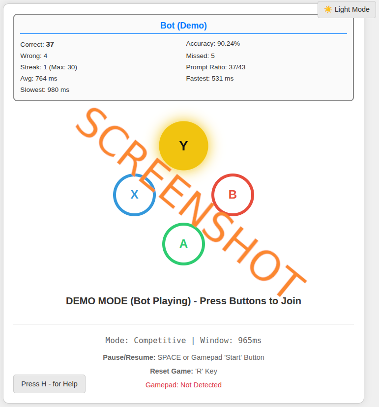

# js_gamepadreaction

## Play it now: https://pemmyz.github.io/js_gamepadreaction/

## Screenshots

# 🎮 Universal Reaction Challenge

A **multiplayer reflex & reaction game** for the browser.  
Test your speed against friends using **keyboard and/or gamepads** — with full statistics, streak tracking, and a dynamic reaction window that gets faster the better you perform.  

Built with **HTML5, CSS3, and vanilla JavaScript** — no external libraries required.

---

## 🚀 Features

- 🕹️ **Multiplayer Support** (up to 4 players)  
  - Player 1: Arrow Keys  
  - Player 2: WASD  
  - Player 3–4: Gamepads  

- 💡 **Dynamic Prompts**  
  - Random **North / South / East / West** LED indicators  
  - Reaction window shrinks as players succeed, expands on mistakes  

- 📊 **Detailed Player Stats**  
  - Correct, Wrong, Missed inputs  
  - Streaks & Longest Streak  
  - Accuracy % and Prompt Ratio  
  - Average / Fastest / Slowest reaction time  

- 🌓 **Light & Dark Themes** (toggle with ☀️/🌙 button)  

- 🎮 **Gamepad Support**  
  - Full support for Xbox / PlayStation controllers  
  - Pause with Start button
 
- 🎲 **Multiple Game Modes**: Competitive, Co-op, and Points Mode

---

## 🆕 New Game Modes

- **Competitive Mode (Default)**  
  Be the fastest! The first player to hit the correct button scores a point.  
  - Game speeds up on correct hits, slows down on misses.  

- **Co-op Mode**  
  Work together! All active players must press the correct button before time runs out.  
  - If the timer expires, missed players take a penalty.  
  - Miss **3 prompts in a row** (by timeout) → temporary dropout. Rejoin anytime by pressing a button.  

- **Points Mode**  
  Speed ranking system!  
  - 1st correct press = **4 points**, 2nd = **3 points**, 3rd = **2 points**, 4th = **1 point**.  
  - Wrong presses = 0 points.  
  - Round ends shortly after the first correct press.  

---

## 🎮 Controls

### Keyboard
- **Player 1 (Arrow Keys)**  
  - ↑ = North  
  - ← = West  
  - → = East  
  - ↓ = South  

- **Player 2 (WASD)**  
  - W = North  
  - A = West  
  - D = East  
  - S = South  

- **Global**  
  - `SPACE` → Pause / Resume  
  - `R` → Reset  

### Gamepad
- **Face Buttons**  
  - Y / △ → North  
  - X / □ → West  
  - B / O → East  
  - A / X → South  

- **Global**  
  - Start → Pause / Resume  

---

## 📊 Stats Displayed

Each player panel shows:
- ✅ Correct presses  
- ❌ Wrong presses  
- ⏱️ Missed prompts  
- 🔥 Current streak & longest streak  
- 🎯 Accuracy %  
- 📈 Prompt ratio (correct vs total prompts)  
- 🧠 Avg / Fastest / Slowest reaction time  

Global area shows:
- Active play time  
- Current LED reaction window  
- Session time since load  

---

## 💡 Future Ideas

- 🎵 Retro sound effects & background music  
- 🌍 Online multiplayer mode  
- 📱 Mobile touch support  
- 🐸 Secret "AMIGAAA!" Frog Mode  

---

## 📝 Changelog

### v1.1 — New Game Modes Update
- Added **Co-op Mode** (teamwork required, dropout & rejoin mechanic).  
- Added **Points Mode** (ranking system with 4-3-2-1 scoring).  
- Competitive Mode polished (dynamic speed adjustment).  
- `H` → Open Help & Mode Selection (choose Competitive / Co-op / Points)

---

## 📜 License

**MIT License**  
Free to use, modify, and share.

